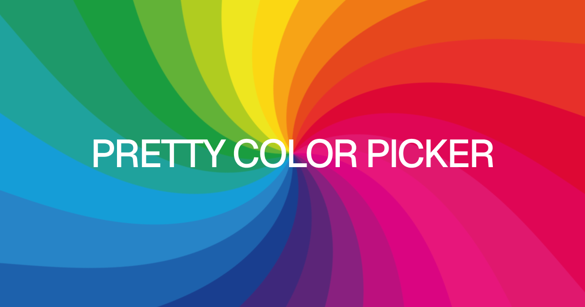

# Pretty Color Picker

A perceptually accurate color picker for the modern web. Colors live in **OKLCH** (`picker.color`); Hex, RGB, HSL, and OKLCH are there for editing and display. The plane is **saturation × value** at the current hue.

Native **Web Component**. Works in any framework or plain HTML.

**[Live demo](https://colors.kiira.in)** · **[npm](https://www.npmjs.com/package/pretty-color-picker)** · **[GitHub](https://github.com/kiiradesign/pretty-color-picker)**



The design and interactions are inspired by [DialKit](https://joshpuckett.me/dialkit). I'm considering contributing this component upstream.

## What's new in 1.0

First stable release — DialKit-aligned UI, locked in as the v1 design:

- Format tabs (**HEX / RGB / HSL / OKLCH**) live in the header; optional close or theme control on the right
- Square saturation × value plane with a **hairline** loupe (Geist/DialKit 1px stroke — not a thick Chrome-style ring)
- Hue and alpha dials at a consistent 36px height with thin contrast thumbs
- Color preview swatch sized and aligned with those dials — separate from the value tray, with the same gap as between dials; click it to copy the active format; a **Copied** chip appears just below the panel
- Compact value inputs with drag-to-scrub (no redundant field labels)
- Title-free Last Used history grid

## Features

- Format tabs (**HEX / RGB / HSL / OKLCH**) as the panel header, with optional close or theme control on the right
- Saturation × value color plane with a hairline, edge-visible loupe
- Hue and alpha dials with DialKit-style contrast thumbs
- Preview swatch flush with the dials, separate from the value tray — click to copy the current color code (tooltip below the picker)
- Compact value inputs with drag-to-scrub (no redundant field labels)
- Last Used swatch history (title-free grid)
- **Popover** mode (anchored to a trigger), movable panel, light / dark / system themes, Shadow DOM

## Install

Published on npm as [`pretty-color-picker`](https://www.npmjs.com/package/pretty-color-picker) (v1.0.0).

```bash
npm install pretty-color-picker
```

## Local demo

From the repo root:

```bash
npm install
npm run dev
```

Then open the URL Vite prints (usually **http://localhost:5173**).

## Usage

```ts
import 'pretty-color-picker'
```

```html
<pretty-color-picker value="#6366f1" theme="system" header-action="close"></pretty-color-picker>

<!-- Popover anchored to a trigger (click outside or Escape to close) -->
<button type="button" id="color-btn">Pick color</button>
<pretty-color-picker
  value="#6366f1"
  mode="popover"
  anchor="#color-btn"
  header-action="close"
></pretty-color-picker>

<!-- Centered floating panel (demo-style) -->
<pretty-color-picker value="#6366f1" movable header-action="close"></pretty-color-picker>

<!-- Without Last Used history -->
<pretty-color-picker value="#6366f1" history="false"></pretty-color-picker>
```

| Attribute       | Values                        | Description                                                                      |
| --------------- | ----------------------------- | -------------------------------------------------------------------------------- |
| `value`         | CSS color                     | Initial color                                                                    |
| `label`         | string                        | Accessible name (default: `Pretty Color Picker`; maps to `aria-label`)           |
| `theme`         | `light` \| `dark` \| `system` | Chrome theme                                                                     |
| `header-action` | `close` \| `theme` \| `none`  | Close button, theme toggle, or no header button                                  |
| `mode`          | `inline` \| `popover`         | `popover` = floating panel anchored to `anchor`                                  |
| `anchor`        | CSS selector                  | Trigger for popover mode (e.g. `#color-btn`)                                     |
| `open`          | present when visible          | Popover visibility (also `show()` / `hide()`)                                    |
| `movable`       | present to enable             | Draggable header (enabled by default in popover mode)                            |
| `history`       | `false` to hide               | Last Used swatch grid (on by default; hidden until the first color is committed) |

**Events:** `change` (`detail.color`, `detail.css`, `detail.hex`) fires while dragging sliders or scrubbing values; field inputs commit on Enter/blur. Not fired on mount. `close` when the panel closes (`header-action="close"` or popover dismiss). `themechange` when the user clicks the built-in theme toggle (`header-action="theme"`).

**API:** `picker.value`, `picker.color` (OKLCH), `picker.label`, `picker.theme`, `picker.headerAction`, `picker.mode`, `picker.anchor`, `picker.open`, `picker.show()`, `picker.hide()`, `picker.toggle()`, `picker.movable`, `picker.history`.

TypeScript types exported from `pretty-color-picker`.

## License

MIT. See [LICENSE](LICENSE). Icons from [Phosphor](https://phosphoricons.com) (MIT).
